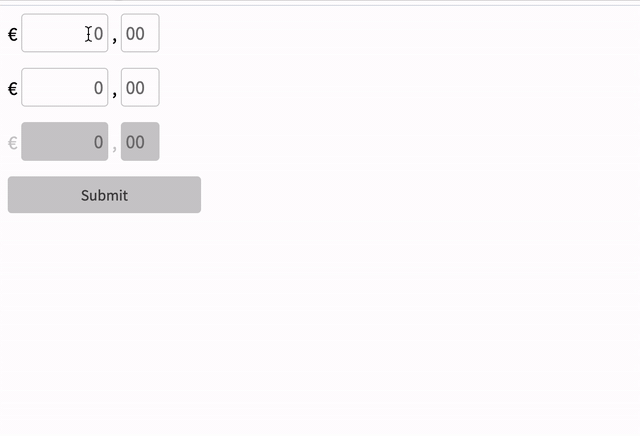

# Rbo Form Components

## Introduction
This document provides the details pertaining to our enclosed technical solution.

I hope you have as much fun reviewing it as I did building and delivering it to you!

**Disclaimer!**

Although a great deal of effort has been put into building this functionality, it's important to note that the components are not yet production-ready.

## Quick demo?


## Budget (roughly 10 hours)

Breakdown:
- 30%: exploring StencilJS, web components spec, CSS variables
- 55%: implementation
- 15%: documentation

## Technical Solution
Our solution was designed from a component-based perspective, with minor shortcuts taken due to time budget restrictions.

### Components

#### rbo-form | [docs](src/components/rbo-form/readme.md)
- Encapsulates the logic for capturing values from the enclosed input fields.
- Listens for errors from child inputs and prevents form submissions if any errors are detected
- Intercepts the form submission events, and emits the `formSubmittedEvent` event.

#### rbo-currency-input | [docs](src/components/rbo-currency-input/readme.md)
- Collects values from two separate text inputs
- Combines input into a single float number which is then communicated to the parent form. (event: `formInputChangeEvent`)
- Mitigates user input issues by systematically auto-correcting the provided input
- Ignore non-numeric characters

#### rbo-button | [docs](src/components/rbo-button/readme.md)
- Wrapper component around the browser-native button.

#### rbo-input-control | [docs](src/components/rbo-input-control/readme.md)
- Simple component to add a little bit of spacing around inputs

### Global styles / variables
As recommnded by the StencilJS team, we've declared our theming css variables in this file:
```
src/global/variables.css
```

## Example usage:
Full example: [here](src/index.html)
```html
<rbo-form id="mortgage-calculator">
  <rbo-input-control>
    <rbo-currency-input name="downPayment" required="true"></rbo-currency-input>
  </rbo-input-control>
</rbo-form>

<script>
var rboForm = document.querySelector('rbo-form');
rboForm.addEventListener('formSubmittedEvent', function(evt) {
  const inputValues = evt.detail.values;
  // Send API request...
})
</script>
```

## The Stack
As per the assignment instructions, we've opted for StencilJS to spin up and package our Web Components.

## Local Development
#### Prerequisites
Make sure that Node and npm are installed on your machine.

#### Install dependencies
```
npm i
```

#### Dev server
```
npm start
```

#### Tests
```
npm t
```

## Improvements / Future work
- Since the currency input component can be repurposed to any decimal number type of input, it probably would have made more sense to 
name it as "decimal input".
- Snapshot tests: would streamline writing unit tests (shallow rendering) for components
- Add labels to inputs
- Implement additional form functionality to handle non-field errors such as network errors for instance